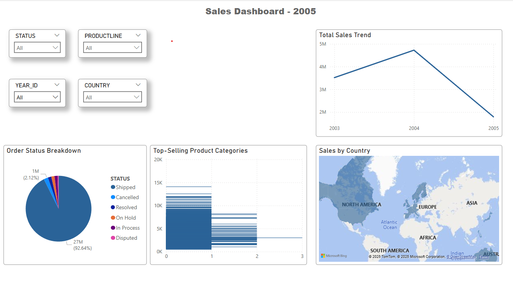

# Sales Data Analysis Dashboard (Power BI)

This project is an interactive Power BI dashboard that analyzes sales performance using a sample sales dataset.

## 🔧 Tools Used
- Power BI
- Excel (for minor data prep)
- Sample sales dataset from Kaggle

## 📊 Key Visuals
- Total Sales Trend (Line Chart)
- Top-Selling Product Categories (Bar Chart)
- Sales by Country (Map)
- Order Status Breakdown (Pie Chart)
- Slicers for Year, Country, Product Line, and Status

## 🧠 Insights
- Identified top-performing product lines
- Visualized sales trends over time
- Analyzed regional performance
- Highlighted order processing patterns

## 📁 Files Included
- `Sales_Data_Dashboard.pbix` — Power BI dashboard file
- `sales_data_sample.csv` — Dataset used
- `images/` — Screenshots of the dashboard 

## 📷 Dashboard Preview

## 📌 Dataset Source
[Sample Sales Data on Kaggle](https://www.kaggle.com/datasets/kyanyoga/sample-sales-data)
